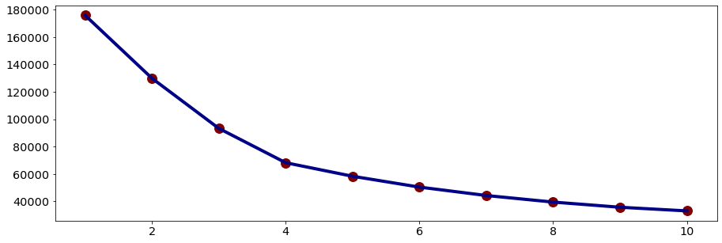
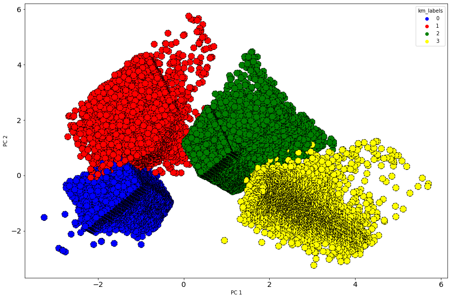

# Clustering: Airline Customer Value Analysis
This project will analyze customers according to their characteristics and perform **customers clustering** based on existing data.

### Dataset description
The dataset used in this project is Airline Customer Value Analysis Case, which consists of 62987 rows (each row represents a customer) and 23 columns (each column represents the characteristics of each customer). This dataset describes the characteristics of a customer on a flight, such as fare revenue for each customers, votes prices, the total distance (km) of flights that customer have been carried out, the distance between the last flight and the last booked flight,  tier of the Frequent Flyer Program, etcetera.

### Goal
Customer clustering and its interpretation will be analyzed  based on the selected characteristics. To achieve this, do:
- Exploratory data analysis, such as handling missing values, duplicate data, and gaining insight from the data.
- Data pre-processing (feature selection, feature transformation, and feature engineering).
- Unsupervised machine learning modeling.
- Model evaluation.

### Unsupervised Machine Learning Modeling
After EDA and data pre-processing, the data set is already clean (no outliers, duplicate data, redundant columns). Furthermore, feature selection will also be carried out for modeling.

Based on the correlation between the columns and the meaning of each column, three columns were selected to be considered for modeling, namely the SEG_KM_SUM(the total distance (km) of flights that have been carried out, avg_discount(the average discount that the customer gets), and AVG_FLIGHT_TIME (average time between flights, which is obtained from the comparison between the first and last flight times with the number of flights made) columns.

The standardized data set is then segmented using the K-means clustering method. The following is a visualization of the results of the cluster model evaluation using the elbow method.

Based on the elbow plot above, it is found that the most optimal number of clusters in this case is **4 clusters** (adding clusters does not significantly reduce the evaluation value).

### Result
Untuk menyederhanakan visualisasi klaster, analisis komponen utama, atau PCA, dilakukan, adalah metode reduksi dimensi yang sering digunakan untuk mengurangi dimensi.

The statistical characteristics for each cluster are described in the table below.
|Cluster|SEG_KM_SUM|AVG_DISCOUNT|AVG_FLIGHT_TIME|Description           |
|-------|----------|------------|---------------|----------------------|
|0      |45842.78  |0.73        |60.87          |Frequent flights      |
|1      |11114.48  |0.59        |117.95         |Quite frequent flights|
|2      |10746.90  |0.87        |125.88         |Made several flights  |
|3      |5144.65   |0.69        |631.16         |Rarely do flights     |

### Insights
- Cluster 0 : Routine Customer - fly frequently, have the most flight distances, and have been given a sizable discount. Promotions need to be done per period to keep customers.
- Cluster 1 : Loyal Customer - Customers who fly frequently enough, and are not sensitive to the discount given. Can be given a premium member.
- Cluster 2 : Standard Customer
- Cluster 3 : Inactive Customer
